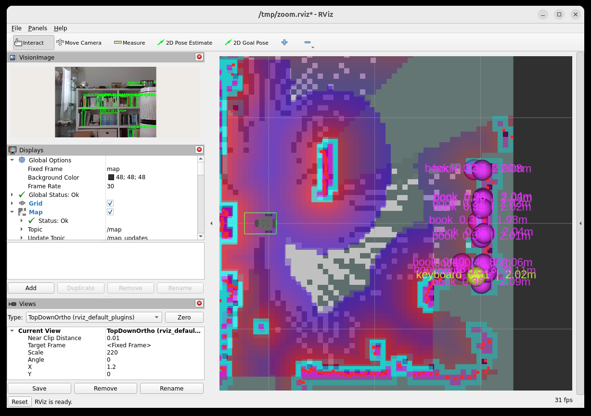

# turtlebot3-slam-nav-vision

ROBOTIS **TurtleBot3 실물 로봇**으로 **SLAM · Navigation · Vision AI**를 구현하는
개인 포트폴리오 프로젝트입니다. 최종 지향점은 로봇청소기처럼 **돌아다니며 지도를
만들면서 동시에 주행하고, 카메라로 주변을 인식하는 자율주행 로봇**입니다.

표준 데모를 그대로 쓰는 게 아니라, **표준과 형태가 다른 커스텀 로봇**에 맞춰
실제 문제(센서 TF 보정, 원격 네트워크 통신 등)를 해결한 과정을 보여주는 것이
핵심입니다.

## 시스템 아키텍처

물리적으로 떨어진 두 머신을 Tailscale(VPN)로 연결하고 역할을 분리합니다.

```
[Raspberry Pi @ TurtleBot3]              [Remote PC / 서버]
  - turtlebot3_bringup (센서 publish)      - Docker (ROS 2 Humble 컨테이너)
  - RealSense D435i (compressed 전송)      - SLAM / Nav2 / Vision AI (개발 대상)
  - zenoh-bridge (systemd)                - zenoh-bridge (컨테이너)
  - Tailscale                             - Tailscale, NVIDIA GPU
        └──────── Tailscale (Zenoh Bridge, tcp/7447) ────────┘
```

- **Pi** = 센서 publish 전용 엣지 (bringup 은 수정하지 않음)
- **Remote PC** = 무거운 연산 전부 (Docker 컨테이너 안에서 개발)

자세한 아키텍처·네트워크·기술 스택은 [CLAUDE.md](./CLAUDE.md)를 참고하세요.

## 기술 스택

| 영역 | 선택 |
|------|------|
| ROS 2 | Humble (Ubuntu 22.04) |
| 실행 환경 | Docker (`osrf/ros:humble-desktop` 기반) |
| SLAM | slam_toolbox (online async) |
| Navigation | Nav2 |
| 원격 통신 | **Zenoh Bridge** (zenoh-bridge-ros2dds) — Fast DDS 의 VPN 한계 진단 후 전환 |
| 카메라 | RealSense D435i — **자체 pyrealsense2 노드** (공식 노드의 Pi4 USB 불안정을 캘리브레이션 캐시·프로세스 분리로 우회), 컬러 + 컬러 정렬 depth compressed 원격 전송 |
| Vision AI | **RF-DETR** + **TensorRT**(fp16, 컨테이너 안에서 엔진 빌드·캐시) + 정렬 depth 거리 → 3D 위치 |
| 센서 융합 | robot_localization (EKF) — 예정 |
| 시각화 | RViz2 |

## 레포 구조

```
turtlebot3-slam-nav-vision/
├── docs/                      # 컴포넌트별 상세 문서 + 트러블슈팅 로그
├── docker/                    # Remote PC 컨테이너 (Dockerfile, entrypoint)
├── docker-compose.yml         # zenoh-bridge + remote-pc 서비스
├── config/                    # zenoh 브리지 설정 등 공용 설정
├── remote_pc/src/             # Remote PC 패키지 (my_slam, my_navigation, my_vision, my_bringup 통합런치)
├── robot/src/                 # Raspberry Pi 패키지 (realsense_bringup)
└── description/               # my_description 패키지: 보정 URDF + 실물 CAD 메시 (RViz 표시용)
```

## 개발한 내용

각 컴포넌트의 "정상 동작 원리"는 `docs/` 에 초심자도 이해할 수준으로 정리돼 있습니다.

| 컴포넌트 | 내용 | 상태 | 문서 |
|---|---|---|---|
| **my_slam** | slam_toolbox 기반 2D SLAM. 로봇 라이다(`/scan`)로 지도 작성 + 위치추정 | ✅ 실물 검증 | [docs/my_slam.md](./docs/my_slam.md) |
| **my_navigation** | Nav2 자율주행. 지도 만들며 주행(기본) / 저장 지도+AMCL 모드. **실측 footprint**(전장 28cm 직사각형) 반영 | ✅ 실기 검증 (실주행 튜닝 예정) | [docs/my_navigation.md](./docs/my_navigation.md) |
| **description** | 커스텀 로봇 URDF 센서 TF 실측 보정 (LDS 위치, IMU 회전·위치, **RealSense 카메라 프레임 체인**) + **실물 CAD 메시**로 RViz 로봇 모델 교체 | ✅ Pi 배포·TF 실기 검증 (전 항목 실측 완료), CAD 메시 RViz 확인 | [docs/description.md](./docs/description.md) |
| **realsense_bringup** | D435i 브링업 — **자체 pyrealsense2 노드**: 컬러 + 컬러에 정렬된 depth(PNG 16bit, mm) compressed publish. 공식 노드가 Pi4 에서 간헐 실패하는 문제를 캘리브레이션 캐시·프로세스 분리 감시·온화한 복구로 해결 | ✅ 원격 수신 검증 (기본 6fps, 15fps 까지 확인) | [docs/realsense_bringup.md](./docs/realsense_bringup.md) |
| **인프라/네트워크** | Tailscale + **Zenoh Bridge** (Fast DDS Discovery Server 의 VPN 한계를 진단 후 전환) | ✅ 검증 완료 | [docs/troubleshooting.md](./docs/troubleshooting.md) |
| **my_bringup** | 통합 런치 — SLAM/AMCL + Nav2 + Vision(map 좌표 마커) + RViz 한 창 (`system.launch.py`, `system.rviz`) | ✅ 실기 검증 | [docs/my_bringup.md](./docs/my_bringup.md) |
| **my_vision** | RF-DETR 물체 검출(torch/**TensorRT** 백엔드) + 정렬 depth 로 거리·3D 위치 → **TF2 로 base_link/map 좌표 변환**(`/vision/objects`), RViz 마커, 주석 영상, 카메라 뷰어 | ✅ 실물 검증 (TensorRT 6ms) | [docs/my_vision.md](./docs/my_vision.md) |

## 시작하기

> 최초 환경 구축(새 머신)은 [docs/pi_setup.md](./docs/pi_setup.md)(로봇) ·
> [docs/server_setup.md](./docs/server_setup.md)(서버) 참고.
> 아래는 구축이 끝난 상태에서의 **일상 실행 절차** — 터미널은 Pi 1개 + 서버 1개면 된다.

### 1. 로봇(Pi) — 터미널 1개

```bash
ssh michael@100.71.74.81                      # 맥에서 (SSH 키 등록돼 있으면 비밀번호 없음)
ros2 launch realsense_bringup full_bringup.launch.py   # 로봇 기본(모터·오도메트리·라이다·TF) + RealSense 카메라
#   카메라 제외: camera:=false / 공식 드라이버로 비교: camera_driver:=realsense2
```
- zenoh-bridge 는 systemd 로 부팅 시 자동 실행 → 따로 할 것 없음 (`systemctl status zenoh-bridge`)
- 정상 로그: `[자식] pipeline.start() 성공` → `스트리밍 시작` → 10초마다 `6.0 fps | color … | depth …`
  (콜드 스타트는 장치 열거에 ~11초 걸리는 게 정상)
- 끝낼 땐 Ctrl+C — 스트리밍 중에 끄는 것이라 안전

개별 실행이 필요할 때:
```bash
ros2 launch turtlebot3_bringup robot.launch.py      # 셸 1 — 로봇 기본
ros2 launch realsense_bringup rs_camera.launch.py   # 셸 2 — 카메라 (자체 노드, 기본 640x480@6fps, 고속 fps:=15)
```

> ⚠️ 시작 중인(아직 fps 로그가 안 찍힌) 카메라 프로세스를 `kill -9` 하지 말 것 — 카메라가 USB 버스에서
> 떨어져 물리 재연결이 필요해진다 ([docs/realsense_bringup.md](./docs/realsense_bringup.md) 7장).

### 2. 서버 — 터미널 1개 ★ 통합 실행 (SLAM + Nav2 + Vision + RViz 한 창)

```bash
docker compose up -d                 # 컨테이너가 내려가 있을 때만 (zenoh-bridge + remote-pc)
docker compose exec remote-pc bash   # 컨테이너 진입 (ROS·워크스페이스 자동 source)

export DISPLAY=:0                    # RViz 를 서버 물리 세션에 띄움 (VNC 로 봄; 번호는 who 로 확인)
ros2 launch my_bringup system.launch.py
```
이 한 줄로 **slam_toolbox + Nav2 + Vision(TensorRT, 검출 물체를 map 좌표 마커로) + RViz** 가 뜬다.
RViz 툴바의 **2D Goal Pose** 로 목표를 찍으면 주행하고, 카메라가 검출한 물체는 지도 위 마커로 보인다
([docs/my_bringup.md](./docs/my_bringup.md)).



자주 쓰는 변형:
```bash
ros2 launch my_bringup system.launch.py use_slam:=false map:=/overlay_ws/maps/my_map.yaml   # 저장 지도 + AMCL
ros2 launch my_bringup system.launch.py threshold:=0.3            # 검출 더 민감하게 (backend:=torch 로 비교 가능)
ros2 launch my_bringup system.launch.py vision:=false             # SLAM + Nav2 만
ros2 run nav2_map_server map_saver_cli -f /overlay_ws/maps/my_map # 지도 저장 (SLAM 모드, 다른 터미널에서)
```
Vision 설정(모델·가중치 경로·임계값·백엔드·TensorRT 옵션)은 `remote_pc/src/my_vision/config/vision_params.yaml`
한 곳에서 바꾼다. 전이학습 모델은 YAML 의 `weights` 에 .pth 경로 (클래스 수 자동 추론, 엔진 캐시 자동 분리).

### 3. 확인·디버깅 (서버, 다른 터미널에서 `docker compose exec remote-pc bash`)

```bash
ros2 topic hz /scan                          # 로봇 연결 (~5Hz)
ros2 topic hz /camera/color/compressed       # 카메라 (~6fps). ★ 12Hz 처럼 정수배면 브리지 중복 → 아래 주의 2
ros2 topic echo /vision/objects              # 검출 물체: 클래스·점수 + map(또는 base_link) 좌표 3D 위치
export DISPLAY=:0
ros2 run my_vision camera_viewer                                              # 카메라 원본: color | 정렬 depth | 오버레이
ros2 run my_vision camera_viewer --color-topic /vision/annotated/compressed   # 검출 박스가 그려진 영상 (q 로 종료)
ros2 run my_vision camera_viewer --snapshot /tmp/cam.jpg                      # 창 없이 한 장 저장
ros2 run tf2_ros tf2_echo base_link camera_color_optical_frame               # 카메라 TF (0.058, 0.033, 0.060)
```
개별 컴포넌트만 띄우려면 `ros2 launch my_slam slam.launch.py` / `my_navigation navigation.launch.py` /
`my_vision vision.launch.py` (각 docs 참고).

### 4. 순서·주의

1. **Pi 먼저(bringup+카메라) → 서버(system.launch)** 가 자연스럽지만, 반대여도 붙는다.
2. **서버 브리지를 재시작·재생성했다면 Pi 브리지도 같이** — Pi 에서 `kill $(pgrep -f "zenoh-bridge-ros2dd[s]")`
   (systemd 가 3초 뒤 자동 재시작, sudo 불필요). 안 하면 토픽이 2배로 중복 수신되어 검출이 멈출 수 있다
   ([docs/troubleshooting.md](./docs/troubleshooting.md) 2026-09-08).
3. "토픽은 보이는데 데이터 0" 이면 브리지 재시작: 서버 `docker compose restart zenoh-bridge` + 위 2번.
4. Pi 전원이 OpenCR 5V 나 5V/3A 어댑터면 카메라 부하에서 CPU 가 600MHz 로 스로틀돼 fps 가 떨어진다 —
   전원 보강 전까진 정상 현상 (`vcgencmd get_throttled` 의 bit0).
5. 새 패키지/파일이 추가된 커밋을 받았을 때만 재빌드: 서버 `cd /overlay_ws && colcon build --symlink-install`,
   Pi `cd ~/realsense_ros_ws && colcon build --packages-select realsense_bringup --symlink-install`.

### 참고

- Pi↔서버 통신은 zenoh-bridge 가 담당하며, 브리징되는 토픽은
  `config/zenoh-bridge-server.json5` / `robot/config/zenoh-bridge-pi.json5` 의
  allow 리스트로 관리합니다 (카메라는 compressed 만 — raw 는 대역폭 초과).
- 카메라 토픽: `/camera/color/compressed`(JPEG) · `/camera/depth/compressed`(컬러 정렬
  depth, PNG 16bit mm) · `/camera/color/camera_info`, 셋 다 같은 stamp, best effort QoS.
- 상세 개발 문서: [docs/](./docs/) · 프로젝트 전체 컨텍스트: [CLAUDE.md](./CLAUDE.md)
