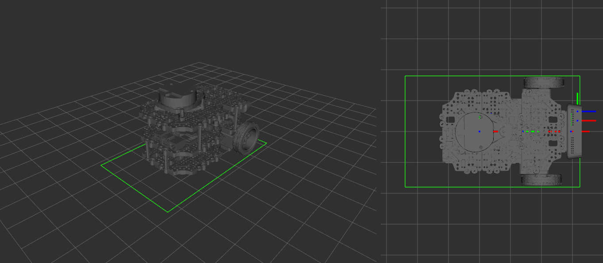

# description — 커스텀 로봇 URDF 보정

> 로봇 분야를 전혀 모르는 사람도 이 문서와 코드를 같이 보면
> "무엇이 어떻게 계산되고, 그래서 값을 왜 이렇게 바꿨는지"를
> 이해할 수 있도록 쓴 문서다. 좌표계/TF 기초는
> [my_slam.md](./my_slam.md) 2장을 먼저 읽는 것을 권장.

## 1. 이게 왜 필요한가 (한 줄 요약)

**이 로봇은 ROBOTIS 표준 burger 와 센서 위치가 다르다. 표준 URDF 를 그대로
쓰면 "라이다가 로봇 어디에 붙어 있는지"를 잘못 알아서 SLAM 지도가 어긋난다.**
그래서 실측값으로 센서 위치를 보정한 URDF 를 만들어 둔다.

## 2. URDF 가 하는 일 — "부품 조립도"가 "좌표 변환"이 된다

URDF(Unified Robot Description Format)는 로봇을 **링크(link, 뼈대=좌표계)** 와
**조인트(joint, 두 링크의 연결)** 로 기술하는 XML 이다. 각 fixed 조인트의

```xml
<origin xyz="x y z" rpy="roll pitch yaw"/>
```

한 줄은 **"자식 링크가 부모 링크 기준으로 (xyz)만큼 떨어져 (rpy)만큼 회전돼 있다"**
는 뜻이고, 이것이 그대로 `/tf_static` 좌표 변환이 된다. 즉 URDF 의 숫자 = TF 트리의
고정 변환값이다. (움직이는 변환인 odom→base_footprint 는 URDF 가 아니라 바퀴
오도메트리가 만든다 — my_slam.md 참고.)

**좌표 규약(ROS REP-103)**: 단위는 미터(m)·라디안(rad). x=앞(+)/뒤(−),
y=왼쪽(+)/오른쪽(−), z=위(+)/아래(−). rpy 중 yaw 는 z축 회전(위에서 본 좌우 돌기),
**위에서 봤을 때 반시계가 +, 시계가 −**.

## 3. 표준 대비 무엇을 바꿨나

기준점 `base_link` 는 **좌우 바퀴 축의 중심**에 있다(바퀴가 x=0 에 있으므로).
따라서 모든 센서 위치는 "바퀴 축 중심"에서 잰 값이다.

| 조인트 | 항목 | 표준값 | **보정값(실측)** | 왜 바꿨나 |
|---|---|---|---|---|
| `scan_joint` | LDS 위치 xyz | `-0.032, 0, 0.172` | **`-0.100, 0, 0.125`** | 라이다를 뒤로·낮게 개조 |
| `imu_joint` | IMU 회전 rpy | `0, 0, 0` | **`0, 0, -1.57`** | OpenCR 을 시계방향 90° 돌려 장착 |
| `imu_joint` | IMU 위치 xyz | `-0.032, 0, 0.068` | **`-0.030, 0, 0.060`** | OpenCR 보드 기하학적 중심 실측 (2026-09-08) |
| `camera_mount_joint` (신규) | RealSense 마운트 나사 구멍 xyz | (표준엔 없음) | **`0.0475, 0, 0.048`** | D435i 를 앞쪽 위에 장착 (2026-09-08 실측) |

바꾸지 않은 것: `wheel_*_joint`/`base_joint`(바퀴 폭이 표준과 동일 → 오도메트리
파라미터 유지), `caster_back_joint`(센싱 무관), 각 링크의 collision/inertial
(시뮬레이션용이라 실물 SLAM/Nav 계산엔 무관). visual 은 3.4 절의 CAD 메시로 교체.

### 3.1 scan_joint — LDS 라이다 위치 (SLAM 품질의 핵심)

보정값 `xyz="-0.100 0 0.125"` 의 의미:
- **x = −0.100**: 바퀴 축(회전 중심)에서 **뒤로 100mm**. (표준은 32mm)
- **y = 0**: 로봇 중심선상 (좌우 치우침 없음).
- **z = 0.125**: base_link 기준 **125mm 위**. base_link 가 바닥에서 10mm 위에
  있으므로, LDS 빔 평면은 **바닥에서 약 135mm** (표준 ~182mm 보다 낮음).

**왜 x 가 특히 중요한가 (회전 시 벽 이중선의 원리)**: 로봇이 제자리 회전하면
회전 중심은 바퀴 축이다. LDS 가 실제로는 축에서 100mm 뒤에 있는데 URDF 엔
32mm 로 적혀 있으면, 회전할 때마다 스캔이 실제와 다른 반경으로 원을 그리며
어긋난다. slam_toolbox 는 같은 벽을 조금씩 다른 위치에 여러 번 그려서 **벽이
두 겹으로 번지거나 지도가 밀린다.** 이 값을 실측으로 맞추는 것이 보정의 핵심.

(z 높이는 2D SLAM 정확도엔 상대적으로 영향이 작지만 — 스캔이 2D 로 투영되므로 —
추후 카메라/센서 정합과 3D 일관성을 위해 정확히 반영해 둔다.)

### 3.2 imu_joint — IMU(OpenCR) 장착 회전

OpenCR 보드를 **위에서 봤을 때 시계방향 90°** 회전하여 고정했으므로 yaw = −90°
= **−1.57 rad**. IMU 데이터(방향/각속도)는 imu_link 프레임 기준으로 해석되는데,
이 프레임이 실제 장착 방향과 어긋나면 융합 결과가 틀어진다.

- 위치(xyz)는 2026-09-08 **OpenCR 보드의 기하학적 중심**을 실측해 `-0.030 0 0.060` 으로 교체했다
  (바퀴 축에서 뒤로 30mm, 중앙, base_link 기준 60mm 위). 엄밀히는 보드 위 IMU 칩 위치가 맞지만,
  이 로봇 속도에선 수 mm 오프셋이 EKF 의 원심가속도 보정에 미치는 영향이 잡음보다 작아
  보드 중심으로 충분하다. 중요한 건 방향(yaw)이며 그건 물리 검증이 끝났다.

### 3.3 카메라 — 실측은 한 점, 렌즈 위치는 인텔 공식 오프셋

RealSense D435i 는 렌즈가 여럿(RGB, 왼쪽/오른쪽 IR, 프로젝터)이라 렌즈를 직접 재면 오차와
혼동이 생긴다. 그래서 **바닥의 1/4인치 마운트 나사 구멍(=몸체 정중앙)** 한 점만 실측하고,
그 아래는 인텔 `realsense2_description` 의 `_d435.urdf.xacro` 상수를 그대로 옮겼다:

```
base_link ─(실측 47.5, 0, 48mm)─▶ camera_bottom_screw_frame
   ─(+10.6, +17.5, +12.5)─▶ camera_link            = 왼쪽 IR 이미저 = depth 원점
        ├─(0, 0, 0)─▶ camera_depth_frame ─(광학 회전)─▶ camera_depth_optical_frame
        └─(0, +15, 0)─▶ camera_color_frame ─(광학 회전)─▶ camera_color_optical_frame  ★ 우리 노드의 frame_id
```
- 카메라 시점에서 왼쪽→오른쪽 순서는 **RGB — 왼쪽 IR — 프로젝터 — 오른쪽 IR** 이고 RGB 는 왼쪽 IR 의
  15mm 왼쪽이다. 우리 카메라의 공장 익스트린식(캘리브레이션 캐시, depth→color 14.9mm)과 일치.
- **광학 프레임(optical)**: 이미지 처리 규약(z 앞, x 오른쪽, y 아래)으로 축만 돌린 프레임. 자체 카메라
  노드가 내보내는 정렬 depth·camera_info·검출 3D 위치는 전부 `camera_color_optical_frame` 기준이다.
  URDF 의 `rpy="-1.5708 0 -1.5708"` 이 ROS 몸체 규약(x 앞, y 왼쪽, z 위)을 광학 규약으로 바꾸는 회전.
- 결과 (base_link 기준): RGB 렌즈 = (58.1, 32.5, 60.5) mm. 수평 장착 가정(pitch 0) — 기울어져
  있으면 `camera_mount_joint` 의 pitch 하나만 고치면 된다.
- 이 TF 가 있어야 Vision 노드의 "카메라 좌표 3D 위치"를 `base_link`/`map` 좌표로 옮길 수 있다.

### 3.4 몸체 visual — 실물 CAD 통짜 메시 (2026-09-09)

**무엇을**: RViz RobotModel 이 그리는 로봇 모양을 ROBOTIS 표준 burger 메시에서
**실물을 직접 CAD 로 모델링한 STL** 로 교체했다. 표준 메시(138×148 mm)는 이 로봇
(실측 footprint 282×180 mm)과 크기가 달라 RViz 에서 footprint 초록 사각형과 그림이
전혀 맞지 않았다.

**어떻게** (`description/meshes/`, `description/urdf/turtlebot3_burger.urdf` base_link):

| 항목 | 내용 |
|---|---|
| 파일 | `my_turtlebot3_burger_lowpoly.stl` — CAD 원본(`my_turtleBot3_burger.stl`, 118만 삼각형·59 MB, git 제외)을 Open3D quadric decimation 으로 **10만 삼각형·5 MB** 로 경량화. 외곽 치수 변화 없음 |
| 단위·원점 | **m 단위**(`scale="1 1 1"`), **원점 = base_link**(바퀴 축 정중앙, 바닥에서 10 mm 위), x 앞·y 왼쪽·z 위. 그래서 visual origin 은 `0 0 0` |
| 구성 | 플레이트·기둥·배터리·OpenCR 에 **바퀴·LDS·카메라·캐스터까지 한 메시**. 따라서 `wheel_*_link`·`base_scan`·`camera_link` 의 개별 visual 은 제거(링크·조인트·TF 는 그대로) |
| 파일 위치 | 서버 컨테이너의 **`my_description` 패키지**(레포 `description/` 을 `/overlay_ws/src/my_description` 으로 마운트, colcon 빌드)에서 RViz 가 `package://my_description/meshes/...` 로 읽는다. **Pi 에는 메시가 필요 없다** — robot_state_publisher 는 URDF 텍스트만 publish 하고, 메시를 여는 건 RViz 뿐 |

**왜 이렇게** — 메시는 순수 표시용이다. Nav2 는 footprint 다각형, SLAM 은 라이다·TF,
Vision 은 TF 체인만 쓰므로 메시가 틀려도 주행은 같다. 대신 통합 RViz 에서 "그림 = 실물
= footprint" 가 맞아야 footprint 튜닝·검출 마커 위치를 눈으로 검증할 수 있다.
CAD 를 base_link 원점으로 그리면 URDF 쪽 오프셋 보정이 필요 없고, 메시 외곽을 footprint
와 직접 비교해 좌표계가 맞는지 검증할 수 있다(아래 검증 기록).

주의: 바퀴가 base_link 메시에 포함돼 RViz 에서 **바퀴는 회전하지 않는다**(표시만).
CAD 를 다시 export 하면 같은 방법으로 경량화한다(10만 삼각형 이하 권장 — RViz 로드 시간·git 용량).



## 4. 배포 방법 — bringup 은 건드리지 않는다

TF 를 publish 하는 `robot_state_publisher` 는 **Pi 의 turtlebot3_bringup** 이
띄우며, `turtlebot3_description` 패키지의 `turtlebot3_burger.urdf` 를 로드한다.
bringup 의 코드/런치는 수정하지 않는 것이 원칙이므로, **로드되는 URDF 파일만**
이 보정판으로 교체한다:

```bash
# Pi 에서 (git pull 로 이 레포를 받은 뒤) — 이 Pi 는 소스 빌드 + symlink-install
# 이라 src 의 원본 파일을 교체하면 install 에 자동 반영된다 (pi_setup.md 8단계)
TARGET=~/turtlebot3_ws/src/turtlebot3/turtlebot3_description/urdf/turtlebot3_burger.urdf
cp "$TARGET" "$TARGET.orig"      # 원본 백업
cp ~/turtlebot3-slam-nav-vision/description/urdf/turtlebot3_burger.urdf "$TARGET"

# 이후 bringup 을 (재)실행하면 보정된 TF 가 나온다
ros2 launch turtlebot3_bringup robot.launch.py
```

> `TURTLEBOT3_MODEL=burger` 를 그대로 쓰므로 모델명 변경은 필요 없다.
> ⚠️ URDF **주석에 콜론+공백/줄끝 콜론 금지** — bringup 이 robot_description 을
> YAML 로 파싱하다 깨진다 (troubleshooting.md 2026-08-26 사건). 배포 전
> `python3 -c "import yaml; yaml.safe_load(open('<파일>').read())"` 로 검사.

## 5. 검증 기록

**파싱·로드 검증 (2026-07-22, Remote PC 컨테이너)**
- `xacro` 파싱 성공, `robot_state_publisher` 로드 성공 — 모든 세그먼트 인식
- 파싱 결과에서 보정값 확인:
  `scan_joint origin xyz="-0.100 0 0.125" rpy="0 0 0"`,
  `imu_joint origin rpy="0 0 -1.57"`

**Pi 배포 + TF 실기 검증 (2026-08 완료)**
- 배포 중 주석 콜론으로 bringup YAML 파싱 실패 발생 → 주석 수정으로 해결
  (troubleshooting.md 2026-08-26)
- 배포 후 서버에서 실기 확인:
  `tf2_echo base_link base_scan` → Translation `[-0.100, 0.000, 0.125]` ✓
  `tf2_echo base_link imu_link` → RPY `[0, 0, -1.570]` ✓
- SLAM 대략 주행에서 지도 정상 생성 확인. **제자리 회전 정밀 검증(벽 이중선
  여부)은 공간 확보 시 진행** — 벽이 회전돼 보이면 scan_joint 의 yaw 를
  경험적으로 보정.

**IMU 회전(yaw=-1.57) 물리 검증 (2026-09-02 완료)**
- 정지 상태: 가속도 z=+9.97 m/s² (중력) → 보드 수평(roll/pitch=0) 확인.
  y 축에 +0.7 바이어스 관찰 — 약 4° 기울기 또는 센서 오프셋, EKF 단계에서
  바이어스 보정으로 처리 (기록용).
- 축 반응 테스트 (rqt_plot 으로 /imu/linear_acceleration 관찰):
  로봇을 **앞으로 밀면 y 축**이, **좌우로 흔들면 x 축**이 반응 —
  "위에서 봤을 때 시계방향 90° 회전 장착"과 정확히 일치.
  → **URDF yaw=-1.57 이 실물과 부합함을 물리적으로 확정.**
- 위치(xyz)는 2026-09-08 보드 중심 실측으로 교체 (3.2 절, 아래 검증 기록).

**RealSense 카메라 TF (2026-09-08 실측·추가)**
- base_link → 마운트 나사 구멍 실측 x +47.5, y 0, z +48 mm. xacro·check_urdf 통과, 합성 변환 확인
  (RGB 렌즈 58.1, 32.5, 60.5 mm / optical z 축이 로봇 앞을 향함).
- 카메라 기울기: 실측 결과 수평 → pitch 0 확정.
- IMU 위치 실측 배포 후 `tf2_echo base_link imu_link` → `[-0.030, 0.000, 0.060]`, yaw `-1.570` ✓ (2026-09-08)
- Pi 배포(2026-09-08) 후 bringup 정상 기동, 서버에서 실기 확인:
  `tf2_echo base_link camera_color_optical_frame` → Translation `[0.058, 0.033, 0.060]`,
  RPY `[-1.571, 0, -1.571]` ✓ / `camera_link` → `[0.058, 0.018, 0.060]` ✓ / `base_scan` 기존값 유지 ✓
  (기울기 실측 수평 → pitch 0 확정).

**CAD 메시 교체 검증 (2026-09-09, 서버 컨테이너)**
- STL 해석: 원본 bbox x −164.8~+64.8, y −87.3~+88.6, z −9.9~+133.0 mm. 바퀴 영역 z −9.6~56.4
  (반지름 33, 축 높이 23 ✓), x 중심 0 ✓ / LDS 상단 133 / 카메라 전면 +64.8 (URDF 카메라 상자
  전면 +62.4 와 2 mm 차 — 렌즈 커버) → **원점·축 방향이 base_link 규약과 일치**.
- 경량화 후 bbox 동일(소수점 이하 변화), 10만 삼각형·5.0 MB.
- 컨테이너에서 `robot_state_publisher`(xacro 처리) + RViz RobotModel + footprint 폴리곤 겹쳐 확인:
  메시 로드 성공, 폭(±0.090)·앞(+0.062)은 footprint 와 일치, base_scan TF 가 메시 LDS 중심에 위치.
  **뒤쪽은 메시 −0.165 m 인데 footprint 는 −0.220 m 로 55 mm 차이** — 실측 footprint(2026-09-08)
  또는 CAD 중 한쪽 확인 필요 (사용자 확인 대기).
- RViz 가 `package://my_description` 을 찾으려면 **overlay 워크스페이스가 source 돼 있어야**
  한다 (`/opt/ros/humble` 만 source 한 셸에선 "Package [my_description] does not exist").

## 6. 다음 단계

1. **제자리 회전 정밀 검증** — 공간 확보 시 (위 검증 기록 참고).
2. ~~카메라 기울기~~ 수평 확인 / ~~IMU 위치 실측~~ 완료 / ~~Nav2 footprint~~ 완료 (my_navigation.md)
   — 2026-09-08 실측 세션으로 URDF·footprint 실측 항목은 전부 반영됨.
3. robot_localization(EKF) 설정 시 imu_link 위치·방향 그대로 사용.
4. footprint 뒤쪽(−0.220) vs CAD 메시(−0.165) 55 mm 차이 확인 후 한쪽 수정.
